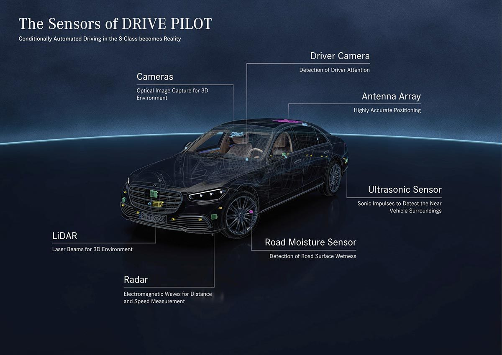

# Autonomous-Driving-Security-Resources

Welcome to my GitHub repository dedicated to the field of **autonomous driving security**. Autonomous driving technology is rapidly transforming our transportation systems and modes of travel. However, along with these advancements, we must also focus on addressing the safety and security challenges associated with autonomous driving. The goal of this repository is to gather and curate literature, research papers, reports, and resources related to autonomous driving safety to assist researchers, engineers, and the general public in better understanding and exploring this critical domain. If you have any literature or resources related to autonomous driving safety, please feel free to contribute to this repository as we work together to promote the safe development of autonomous driving technology.

欢迎来到我的GitHub仓库，这里是一个专注于 **自动驾驶安全** 的知识库。自动驾驶技术正日益改变着我们的交通系统和出行方式，但与之同时，我们也必须关注和解决与自动驾驶相关的安全挑战。这个仓库的目标是收集和整理与自动驾驶安全相关的文献、研究论文、报告和资源，以帮助研究人员、工程师和社会大众更好地了解和探讨这一重要领域的问题。如果您有任何有关自动驾驶安全的文献或资源，欢迎贡献到这个仓库，让我们一起努力推动自动驾驶技术的安全发展。

## News

- 2023/10/10: I initialize the repository and add papers.

## Table of Contents

- [Langya-Ranking](#Langya-Ranking)
- [Relevant Conferences](#Relevant-Conferences)
- [Relevant Journals](#Relevant-Journals)
- [Papers](#Papers)
  - [Survey](#Survey)
  - [Camera Attack](#Camera-Attack)
  - [Lane Detection Attack](#Lane-Detection-Attack)
  - [LiDAR Attack](#LiDAR-Attack)
  - [Multi-Sensor Fusion Attack](#Multi-Sensor-Fusion-Attack)
  - [System Testing](#System-Testing)
  - [Scenario Generation](#Scenario-Generation)
  - [Anomaly Detection](#Anomaly-Detection)
  - [Other](#Other)
- [Datasets](#Datasets)

## Langya-Ranking

| Name           | Organization                     | Link                                                         |
| -------------- | -------------------------------- | ------------------------------------------------------------ |
| Weisong Shi    | University of Delaware           | [[HomePage](https://www.weisongshi.org/)] [[Scholar](https://scholar.google.com/citations?user=4rPcoCEAAAAJ&hl=en&oi=ao)] |
| Yiheng Feng    | Purdue University                | [[HomePage](https://engineering.purdue.edu/CE/People/ptProfile?resource_id=244000)] [[Scholar](https://scholar.google.com/citations?hl=zh-CN&user=Ykk41g4AAAAJ)] |
| Z. Morley Mao  | University of Michigan           | [[HomePage](http://www.eecs.umich.edu/~zmao)] [[Scholar](https://scholar.google.com/citations?user=Ba_Ci9UAAAAJ&hl=zh-CN)] |
| Qi Alfred Chen | University of California, Irvine | [[HomePage](https://www.ics.uci.edu/~alfchen/)] [[Scholar](https://scholar.google.com/citations?user=lcsu7m8AAAAJ)] |
| Yulong Cao     | University of Michigan / NVIDIA  | [[HomePage](https://kikacaty.github.io/)] [[Scholar](https://scholar.google.com/citations?user=uclqBzgAAAAJ&hl=zh-CN)] |

## Relevant Conferences

|      Abbr.      | Full Name                                                  |       Category       | CCF-Rank |
| :-------------: | ---------------------------------------------------------- | :------------------: | :------: |
|       CCS       | ACM Conference on Computer and Communications Security     |       Security       |  CCF-A   |
|      NDSS       | Network and Distributed System Security Symposium          |       Security       |  CCF-A   |
|  S&P (Oakland)  | IEEE Symposium on Security and Privacy                     |       Security       |  CCF-A   |
| Usenix Security | USENIX Security Symposium                                  |       Security       |  CCF-A   |
|      ECCV       | European Conference on Computer Vision                     |   Computer Vision    |  CCF-B   |
|      CVPR       | Computer Vision and Pattern Recognition                    |   Computer Vision    |  CCF-A   |
|      ICCV       | IEEE International Conference on Computer Vision           |   Computer Vision    |  CCF-A   |
|     ACM MM      | ACM International Conference on Multimedia                 |      Multimedia      |  CCF-A   |
|       ASE       | International Conference on Automated Software Engineering | Software Engineering |  CCF-A   |
|      ICSE       | International Conference on Software Engineering           | Software Engineering |  CCF-A   |
|      ISSTA      | International Symposium on Software Testing and Analysis   |   Software Testing   |  CCF-A   |

## Relevant Journals

| Abbr. | Full Name                                               |       Rank        |
| :---: | ------------------------------------------------------- | :---------------: |
| TIFS  | IEEE Transactions on Information Forensics and Security | CCF-A / 中科院1区 |
| TITS  | IEEE Transactions on Intelligent Transportation Systems | CCF-B / 中科院1区 |
|  TIV  | IEEE Transactions on Intelligent Vehicles               |     中科院1区     |
|  TVT  | IEEE Transactions on Vehicular Technology               |     中科院2区     |
|  TRE  | IEEE Transactions on Reliability                        | CCF-C / 中科院2区 |

## Papers

### Survey

- **Visually Adversarial Attacks and Defenses in the Physical World: A Survey.** [[pdf](https://arxiv.org/abs/2211.01671)]
  - Xingxing Wei,Bangzheng Pu, Jiefan Lu, Baoyuan Wu. *arXiv, 2023.*

- **Recent Advancements in End-to-End Autonomous Driving using Deep Learning: A Survey.** [[pdf](https://arxiv.org/pdf/2307.04370.pdf)]
  - Pranav Singh Chib, Pravendra Singh. *arXiv, 2023.*

- **Deep learning for safe autonomous driving: Current challenges and future directions.** [[pdf](https://www.researchgate.net/profile/Khan-Muhammad-5/publication/347865238_Deep_Learning_for_Safe_Autonomous_Driving_Current_Challenges_and_Future_Directions/links/5fec60fba6fdccdcb817162a/Deep-Learning-for-Safe-Autonomous-Driving-Current-Challenges-and-Future-Directions.pdf)]
  - Khan Muhammad, Amin Ullah, Jaime Lloret, Javier Del Ser, Victor Hugo C. de Albuquerque. *IEEE Transactions on Intelligent Transportation Systems, 2021*.

- **Deep learning-based autonomous driving systems: A survey of attacks and defenses.** [[pdf](https://ieeexplore.ieee.org/abstract/document/9397393/)]
  - Yao Deng, Tiehua Zhang, Guannan Lou, Xi Zheng, Jiong Jin, Qing-Long Han. *IEEE Transactions on Industrial Informatics, 2021.* 

- **Autonomous driving security: State of the art and challenges.** [[pdf](https://ieeexplore.ieee.org/abstract/document/9625017/)]
  - Cong Gao, Geng Wang, Weisong Shi, Zhongmin Wang, Yanping Chen. *IEEE Internet of Things Journal, 2021.*

### Camera Attack

- **Attacking vision-based perception in end-to-end autonomous driving models.** [[pdf](https://www.sciencedirect.com/science/article/abs/pii/S1383762120300606)] [[code](https://github.com/xz-group/AdverseDrive)]
  - Adith Boloor, Karthik Garimella, Xin He, Christopher Gill, Yevgeniy Vorobeychik, Xuan Zhang. *Journal of Systems Architecture, 2020*.

### Lane Detection Attack

- **Lateral-Direction Localization Attack in High-Level Autonomous Driving: Domain-Specific Defense Opportunity via Lane Detection.** [[pdf](https://arxiv.org/abs/2307.14540)]
  - Junjie Shen, Yunpeng Luo, Ziwen Wan, Qi Alfred Chen. *arXiv, 2023.*

- **Physical Backdoor Attacks to Lane Detection Systems in Autonomous Driving.** [[pdf](https://arxiv.org/pdf/2203.00858.pdf)] [[note](https://blog.csdn.net/m0_38068876/article/details/132547172)]
  - Xingshuo Han, Guowen Xu, Yuan Zhou\*, Xuehuan Yang, Jiawei Li, Tianwei Zhang. *ACM International Conference on Multimedia, 2022*.

- **Too Good to Be Safe: Tricking Lane Detection in Autonomous Driving with Crafted Perturbations.** [[pdf](https://www.usenix.org/conference/usenixsecurity21/presentation/jing)]
  - Pengfei Jing, Qiyi Tang, Yuefeng Du, Lei Xue, Xiapu Luo, Ting Wang, Sen Nie, Shi Wu. *Usenix Security, 2021.*

- **Dirty Road Can Attack: Security of Deep Learning based Automated Lane Centering under Physical-World Attack.** [[pdf](https://www.usenix.org/conference/usenixsecurity21/presentation/sato)]
  - Takami Sato, Junjie Shen, Ningfei Wang, Yunhan Jia, Xue Lin, Qi Alfred Chen. *Usenix Security, 2021.*

### LiDAR Attack

- **You Can't See Me: Physical Removal Attacks on LiDAR-based Autonomous Vehicles Driving Frameworks.** [[pdf](https://www.usenix.org/conference/usenixsecurity23/presentation/cao)]
  - Yulong Cao, S. Hrushikesh Bhupathiraju, Pirouz Naghavi, Takeshi Sugawara, Z. Morley Mao\*, Sara Rampazzi. *Usenix Security, 2023.*
- **Who Is in Control? Practical Physical Layer Attack and Defense for mmWave-Based Sensing in Autonomous Vehicles.** [[pdf](https://ieeexplore.ieee.org/abstract/document/9417240)]
  - Zhi Sun, Sarankumar Balakrishnan, Lu Su, Arupjyoti Bhuyan, Pu Wang, Chunming Qiao. *IEEE Transactions on Information Forensics and Security (TIFS) 2021.*

### Multi-Sensor Fusion Attack

- **Security Analysis of {Camera-LiDAR} Fusion Against {Black-Box} Attacks on Autonomous Vehicles**. [[pdf](https://www.usenix.org/conference/usenixsecurity22/presentation/hallyburton)]
  - R. Spencer Hallyburton, Yupei Liu, Yulong Cao, Z. Morley Mao, Miroslav Pajic. *Usenix Security, 2022.*

- **Invisible for both Camera and LiDAR: Security of Multi-Sensor Fusion based Perception in Autonomous Driving Under Physical-World Attacks**. [[pdf](https://arxiv.org/pdf/2106.09249.pdf)]
  - Yulong Cao, Ningfei Wang, Chaowei Xiao, Dawei Yang, Jin Fang, Ruigang Yang, Qi Alfred Chen, Mingyan Liu, Bo Li. *S&P, 2021.*

### Trajectory Prediction Attack

- **Vehicle Trajectory Prediction Works, but Not Everywhere.** [[pdf](https://openaccess.thecvf.com/content/CVPR2022/papers/Bahari_Vehicle_Trajectory_Prediction_Works_but_Not_Everywhere_CVPR_2022_paper.pdf)]
  - Mohammadhossein Bahari, Saeed Saadatnejad, Ahmad Rahimi, Mohammad Shaverdikondori, Amir Hossein Shahidzadeh, Seyed-Mohsen Moosavi-Dezfooli, Alexandre Alahi. *CVPR 2022.*

### System Testing

- **Mind the gap! a study on the transferability of virtual vs physical-world testing of autonomous driving systems.** [[pdf](https://arxiv.org/pdf/2112.11255)]
  - Andrea Stocco, Brian Pulfer, Paolo Tonella. *IEEE Transactions on Software Engineering (TSE), 2022.*
- **DriveFuzz: Discovering Autonomous Driving Bugs through Driving Quality-Guided Fuzzing.**
- **Testing the safety of self-driving vehicles by simulating perception and prediction.** [[pdf](https://arxiv.org/pdf/2008.06020.pdf)]
  - Kelvin Wong, Qiang Zhang, Ming Liang, Bin Yang, Renjie Liao, Abbas Sadat & Raquel Urtasun. *ECCV, 2020.*
- **AV-FUZZER: Finding Safety Violations in Autonomous Driving Systems.** [[pdf](https://ieeexplore.ieee.org/abstract/document/9251068)]
  - *International Symposium on Software Reliability Engineering (ISSRE), 2020.*
- **Adversarial Evaluation of Autonomous Vehicles in Lane-Change Scenarios.** [[pdf](https://ieeexplore.ieee.org/abstract/document/9468363)]
  - Baiming Chen, Xiang Chen, Qiong Wu, Liang Li. *IEEE Transactions on Intelligent Transportation Systems (TITS), 2021*.
- **DeepRoad: GAN-based Metamorphic Testing and Input Validation Framework for Autonomous Driving Systems.** [[pdf](https://dl.acm.org/doi/abs/10.1145/3238147.3238187)]
  - MengshiZhang, Yuqun Zhang, Lingming Zhang, Cong Liu, Sarfraz Khurshid. *International Conference on Automated Software Engineering (ASE), 2018.*
- **DeepTest: Automated Testing of Deep-Neural-Network-driven Autonomous Cars.** [[pdf](https://dl.acm.org/doi/pdf/10.1145/3180155.3180220)]
  - Yuchi Tian, Kexin Pei, Suman Jana, Baishakhi Ray. *International Conference on Software Engineering (ICSE), 2018.*
- **Systematic Testing of Convolutional Neural Networks for Autonomous Driving.** [[pdf](https://arxiv.org/abs/1708.03309)]
  - Tommaso Dreossi, Shromona Ghosh, Alberto Sangiovanni-Vincentelli, Sanjit A. Seshia. *arXiv, 2017.*

### Scenario Generation

- **A survey on safety-critical driving scenario generation—A methodological perspective.** [[pdf](https://arxiv.org/pdf/2202.02215)]
  - Wenhao Ding, Chejian Xu, Mansur Arief, Haohong Lin, Bo Li, Ding Zhao. *IEEE Transactions on Intelligent Transportation Systems (TITS), 2023*.

- **Online Adaptive Generation of Critical Boundary Scenarios for Evaluation of Autonomous Vehicles.** [[pdf](https://ieeexplore.ieee.org/document/10056393)]
  - Junjie Zhou, Lin Wang, Xiaofan Wang. *IEEE Transactions on Intelligent Transportation Systems (TITS), 2023*.

- **SceGene: Bio-Inspired Traffic Scenario Generation for Autonomous Driving Testing.** [[pdf](https://ieeexplore.ieee.org/abstract/document/9662987)]
  - Ao Li, Shitao Chen, Liting Sun, Nanning Zheng, Masayoshi Tomizuka, Wei Zhan. *IEEE Transactions on Intelligent Transportation Systems (TITS), 2022.*

- **Test Scenario Generation and Optimization Technology for Intelligent Driving Systems.** [[pdf](https://ieeexplore.ieee.org/abstract/document/8985542)]
  - Jianli Duan, Feng Gao, Yingdong He. *IEEE Intelligent Transportation Systems Magazine, 2020.*

- **Learning to Collide: An Adaptive Safety-Critical Scenarios Generating Method.** [[pdf](https://arxiv.org/abs/2003.01197)]
  - Wenhao Ding, Baiming Chen, Minjun Xu, Ding Zhao. *IEEE/RSJ International Conference on Intelligent Robots and Systems (IROS), 2020.*

### Anomaly Detection

- **Detecting the Anomalies in LiDAR Pointcloud.** [[pdf](https://arxiv.org/abs/2308.00187)]
  - Chiyu Zhang, Ji Han, Yao Zou, Kexin Dong, Yujia Li, Junchun Ding, Xiaoling Han. *arXiv, 2023.*

## End to End

- **Adversarial Driving: Attacking End-to-End Autonomous Driving.** [[pdf](https://ieeexplore.ieee.org/abstract/document/10186386)]
  - Han Wu, Syed Yunas, Sareh Rowlands, Wenjie Ruan, Johan Wahlström. *IEEE Intelligent Vehicles Symposium, 2023*.

### Other

- **Reasoning about Safety of Learning-Enabled Components in Autonomous Cyber-physical Systems.** [[pdf](https://dl.acm.org/doi/abs/10.1145/3195970.3199852)]
  - Cumhur Erkan Tuncali, James Kapinski, Hisahiro Ito, Jyotirmoy V. Deshmukh. *Annual Design Automation Conference, 2018.*

## Datasets

- **AmodalSynthDrive: A Synthetic Amodal Perception Dataset for Autonomous Driving.** [[pdf](https://arxiv.org/pdf/2309.06547.pdf)]
  - Ahmed Rida Sekkat, Rohit Mohan, Oliver Sawade, Elmar Matthes, Abhinav Valada. *arXiv, 2023.*

- **ADD: An Automatic Desensitization Fisheye Dataset for Autonomous Driving.** [[pdf](https://arxiv.org/pdf/2308.07590.pdf)]
  - Zizhang Wu, Xinyuan Chen, Hongyang Wei, Fan Song, Tianhao Xua. *arXiv, 2023.*

- **SUPS: A Simulated Underground Parking Scenario Dataset for Autonomous Driving.** [[pdf](https://arxiv.org/pdf/2302.12966.pdf)]
  - Jiawei Hou, Qi Chen, Yurong Cheng, Guang Chen, Xiangyang Xue, Taiping Zeng, Jian Pu\*. *arXiv, 2023.*

- **A Survey on Datasets for Decision-making of Autonomous Vehicle.** [[pdf](https://arxiv.org/pdf/2306.16784.pdf)]
  - Yuning Wang, Zeyu Han, Yining Xing, Shaobing Xu\*, Jianqiang Wang\*. *arXiv, 2023.*

- **CityPersons: A Diverse Dataset for Pedestrian Detection.** [[pdf](http://ieeexplore.ieee.org/document/8099957/)]
  - Shanshan Zhang, Rodrigo Benenson, Bernt Schiele. *CVPR, 2017.*

- **Are we ready for autonomous driving? The KITTI vision benchmark suite.** [[pdf](https://projet.liris.cnrs.fr/imagine/pub/proceedings/CVPR2012/data/papers/424_O3C-04.pdf)]
  - Andreas Geiger, Philip Lenz, Raquel Urtasun. *CVPR, 2012.*

