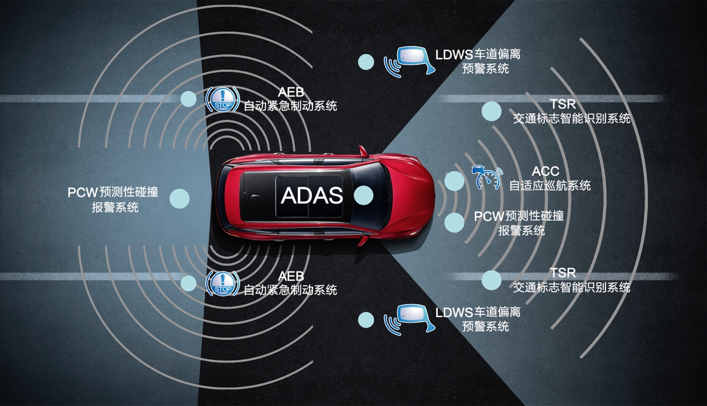

# Autonomous-Driving-Security-Resources

> 🚗 A repository for documenting and exploring the world of autonomous driving safety, featuring a curated collection of research groups, conferences, journals, competitions, papers, reports, and resource. Inspired by [awesome-php](https://github.com/ziadoz/awesome-php).

## Contributing

Please feel free to send me [pull requests](https://github.com/Allenpandas/Autonomous-Driving-Security-Resources/pulls) to add links.

## Table of Contents

- [Foundations](#Foundations)
- [Revelant Repositories](#Revelant-Repositories)
- [Research Labs](#Research-Labs)
- [Relevant Conferences](#Relevant-Conferences)
- [Relevant Journals](#Relevant-Journals)
- [Relevant Competitions](#Relevant-Competitions)
- [Papers](Papers)

## Foundations

- **Artificial Intelligence**
  - [Awesome Machine Learning](https://github.com/josephmisiti/awesome-machine-learning) - A curated list of awesome Machine Learning frameworks, libraries and software. Maintained by Joseph Misiti.Joseph Misiti
  - [Deep Learning Papers Reading Roadmap](https://github.com/songrotek/Deep-Learning-Papers-Reading-Roadmap) - Deep Learning papers reading roadmap constructed from outline to detail, old to state-of-the-art, from generic to specific areas focus on state-of-the-art for anyone starting in Deep Learning. Maintained by, Flood Sung.
  - [Open Source Deep Learning Curriculum](http://www.deeplearningweekly.com/pages/open_source_deep_learning_curriculum) - Deep Learning curriculum meant to be a starting point for everyone interested in seriously studying the field.

- **Robotics**
  - [Awesome Robotics](https://github.com/Kiloreux/awesome-robotics) - A list of various books, courses and other resources for robotics, maintained by kiloreux.

- **Computer Vision**
  - [Awesome Computer Vision](https://github.com/jbhuang0604/awesome-computer-vision) - A curated list of awesome computer vision resources, maintained by Jia-Bin Huang
  - [Awesome Deep Vision](https://github.com/kjw0612/awesome-deep-vision) - A curated list of deep learning resources for computer vision, maintained by Jiwon Kim, Heesoo Myeong, Myungsub Choi, Jung Kwon Lee, Taeksoo Kim

### Revelant Repositories
- [Autonomous Driving Cookbook](https://github.com/microsoft/AutonomousDrivingCookbook) - Scenarios, tutorials and demos for Autonomous Driving.
- [Slam in Autonomous Driving](https://github.com/gaoxiang12/slam_in_autonomous_driving) - SLAM Technology in Autonomous Driving corresponds to open source code.
- [SensorsCalibration](https://github.com/PJLab-ADG/SensorsCalibration)  - A Multi-sensor Calibration Toolbox for Autonomous Driving.

### Research Labs

| University                                    | Institution                                                  | Members                                                      |
| --------------------------------------------- | ------------------------------------------------------------ | ------------------------------------------------------------ |
| University of Delaware                        | [Department of Computer and Information Sciences](https://www.cis.udel.edu/) | [Weisong Shi](https://www.weisongshi.org/) et al.            |
| Purdue University                             | Center for Road Safety                                       | [Yiheng Feng](https://engineering.purdue.edu/CE/People/ptProfile?resource_id=244000) et al. |
| University of Michigan                        | [Department of Electrical Engineering and Computer Science ](http://www.eecs.umich.edu/) | Yulong Cao et al.                                            |
| University of California, Irvine              | Department of Computer Science                               | [Qi Alfred Chen](https://scholar.google.com/citations?user=lcsu7m8AAAAJ) et al. |
| Tsinghua University                           | [School of Behicle and Mobility](http://www.svm.tsinghua.edu.cn/index.html) | [Keqiang Li](https://scholar.google.com/citations?user=x58fnLQAAAAJ&hl=zh-CN&oi=ao), Dian-ge Yang, [Shengbo Li](https://scholar.google.com/citations?user=Dxiw1K8AAAAJ&hl=zh-CN&oi=ao) et al. |
| Tsinghua University                           | [Institute for AI Industry esearch](https://air.tsinghua.edu.cn/) | Yaqin Zhang et al.                                           |
| Tsinghua University                           | [MARS Lab](http://group.iiis.tsinghua.edu.cn/~marslab)       | Hang Zhao et al.                                             |
| Peking University                             | [School of Intelligence Science and Technology](https://www.cis.pku.edu.cn/) | Rongqing Zhao et al.                                         |
| Beijing Institute of Technology               | [School of Mechanical Engineering](https://me.bit.edu.cn/jgsz/jlgcx1/index.htm) | Huiyan Chen, Jianwei Gong et al.                             |
| Beihang University                            | [School of Transportation Science and Engineering](https://transportation.buaa.edu.cn/xkjs/xkfx.htm) | Guizhen Yu, Shichun Yang et al.                              |
| Beijing Jiaotong University                   | [Institute of Information Science](http://iis.bjtu.edu.cn/)  | Yao Zhao, Chunyu Lin et al.                                  |
| Xi'an Jiaotong University                     | [College of Artificial Ingelligence](http://www.aiar.xjtu.edu.cn/) | Nanning Zheng et al.                                         |
| Zhejiang University                           | [Research Center for Intelligent Drive and Future Traffic College of Control Science and Engineering](http://idft.zju.edu.cn/) | Yong Liu, Dongqin Feng et al.                                |
| Nanjing University of Science and Technology  | [Automation Research Institute](http://www.nustcar.com/index.php?s=/home/article/lists/category/yjyjs.html) | Minghu Ren, Jingyu Yang, Zhaoxia Shi et al.                  |
| Tongji University                             | [Intelligent Vehicle and Cooperative control of Multi-agent Lab](https://ivcm.tongji.edu.cn/sysjj.htm) | Lu Xiong, Xichan Zhu, Hao Zhang et al.                       |
| Huazhong University of Science and Technology | [School of Artificial Intelligence and Automation](http://aia.hust.edu.cn/) | Xinggang Wang, Dingxin He, et al.                            |
| Shanghai Jiaotong Univerisity                 | [CyberC3 Intelligent Vehicle Labs](https://cyberc3.sjtu.edu.cn/) | Chengliang Yin, Ming Yang, et al.                            |

(<a href="#top">back to top</a>)

### Relevant Conferences

- **Security**
  - [ACM Conference on Computer and Communications Security (CCS)](https://dblp.org/db/conf/ccs/index.html) - CCF-A
  - [Network and Distributed System Security Symposium (NDSS)](https://dblp.org/db/conf/ndss/index.html) - CCF-A
  - [IEEE Symposium on Security and Privacy (S&P)](https://dblp.org/db/conf/sp/index.html) - CCF-A
  - [USENIX Security Symposium](https://dblp.org/db/conf/uss/index.html) - CCF-A
- **Artificial Intelligence & Computer Vision**
  - [Computer Vision and Pattern Recognition (CVPR)](https://dblp.org/db/conf/cvpr/index.html) - CCF-A
  - [IEEE International Conference on Computer Vision (ICCV)](https://dblp.org/db/conf/iccv/index.html) - CCF-A
  - [European Conference on Computer Vision (ECCV)](https://dblp.org/db/conf/eccv/index.html) - CCF-B
- **Software Engineering**
  - [International Conference on Automated Software Engineering (ASE)](https://dblp.org/db/conf/kbse/index.html) - CCF-A
  - [International Conference on Software Engineering (ICSE)](https://dblp.org/db/conf/icse/index.html) - CCF-A
  - [International Symposium on Software Testing and Analysis (ISSTA)](https://dblp.org/db/conf/issta/index.html) - CCF-A

- **Multimedia**
  - [ACM International Conference on Multimedia (ACM MM)](https://dblp.org/db/conf/mm/index.html)  - CCF-A

(<a href="#top">back to top</a>)

### Relevant Journals

- [IEEE Transactions on Information Forensics and Security (TIFS)](http://ieeexplore.ieee.org/xpl/RecentIssue.jsp?punumber=10206) - CCF-B / JCR Q1
- [IEEE Transactions on Intelligent Transportation Systems (TITS)](http://ieeexplore.ieee.org/xpl/RecentIssue.jsp?punumber=6979) - CCF-B / JCR Q1
- [IEEE Transactions on Intelligent Vehicles (TIV)](https://ieeexplore.ieee.org/xpl/RecentIssue.jsp?punumber=7274857) - JCR Q1
- [IEEE Transactions on Vehicular Technology (TVT)](http://ieeexplore.ieee.org/xpl/RecentIssue.jsp?punumber=25) - JCR Q2
- [IEEE Transactions on Reliability (TR)](http://ieeexplore.ieee.org/xpl/RecentIssue.jsp?punumber=24) - CCF-C / JCR Q2

(<a href="#top">back to top</a>)

### Relevant Competitions

- World Intelligent Driving Challenge, WIDC
- China International Autopilot Challenge, CIAC
- Intelligent Vehicle Future Challenge, IVFC
- [Kaggle](https://link.zhihu.com/?target=https%3A//www.kaggle.com/)
- [Tianchi](https://link.zhihu.com/?target=https%3A//tianchi.aliyun.com/)

(<a href="#top">back to top</a>)

### Papers

#### Survey

- **Visually Adversarial Attacks and Defenses in the Physical World: A Survey.** [[pdf](https://arxiv.org/abs/2211.01671)]
  - Xingxing Wei,Bangzheng Pu, Jiefan Lu, Baoyuan Wu. *arXiv, 2023.*

- **Recent Advancements in End-to-End Autonomous Driving using Deep Learning: A Survey.** [[pdf](https://arxiv.org/pdf/2307.04370.pdf)]
  - Pranav Singh Chib, Pravendra Singh. *arXiv, 2023.*

- **Deep learning for safe autonomous driving: Current challenges and future directions.** [[pdf](https://www.researchgate.net/profile/Khan-Muhammad-5/publication/347865238_Deep_Learning_for_Safe_Autonomous_Driving_Current_Challenges_and_Future_Directions/links/5fec60fba6fdccdcb817162a/Deep-Learning-for-Safe-Autonomous-Driving-Current-Challenges-and-Future-Directions.pdf)]
  - Khan Muhammad, Amin Ullah, Jaime Lloret, Javier Del Ser, Victor Hugo C. de Albuquerque. *IEEE Transactions on Intelligent Transportation Systems, 2021*.

- **Deep learning-based autonomous driving systems: A survey of attacks and defenses.** [[pdf](https://ieeexplore.ieee.org/abstract/document/9397393/)]
  - Yao Deng, Tiehua Zhang, Guannan Lou, Xi Zheng, Jiong Jin, Qing-Long Han. *IEEE Transactions on Industrial Informatics, 2021.* 

- **Autonomous driving security: State of the art and challenges.** [[pdf](https://ieeexplore.ieee.org/abstract/document/9625017/)]
  - Cong Gao, Geng Wang, Weisong Shi, Zhongmin Wang, Yanping Chen. *IEEE Internet of Things Journal, 2021.*

#### Camera Attack and Defense

- **Attacking vision-based perception in end-to-end autonomous driving models.** [[pdf](https://www.sciencedirect.com/science/article/abs/pii/S1383762120300606)] [[code](https://github.com/xz-group/AdverseDrive)]
  - Adith Boloor, Karthik Garimella, Xin He, Christopher Gill, Yevgeniy Vorobeychik, Xuan Zhang. *Journal of Systems Architecture, 2020*.

#### Lane Detection Attack and Defense

- **Lateral-Direction Localization Attack in High-Level Autonomous Driving: Domain-Specific Defense Opportunity via Lane Detection.** [[pdf](https://arxiv.org/abs/2307.14540)]
  - Junjie Shen, Yunpeng Luo, Ziwen Wan, Qi Alfred Chen. *arXiv, 2023.*

- **Physical Backdoor Attacks to Lane Detection Systems in Autonomous Driving.** [[pdf](https://arxiv.org/pdf/2203.00858.pdf)] [[note](https://blog.csdn.net/m0_38068876/article/details/132547172)]
  - Xingshuo Han, Guowen Xu, Yuan Zhou\*, Xuehuan Yang, Jiawei Li, Tianwei Zhang. *ACM International Conference on Multimedia, 2022*.

- **Too Good to Be Safe: Tricking Lane Detection in Autonomous Driving with Crafted Perturbations.** [[pdf](https://www.usenix.org/conference/usenixsecurity21/presentation/jing)]
  - Pengfei Jing, Qiyi Tang, Yuefeng Du, Lei Xue, Xiapu Luo, Ting Wang, Sen Nie, Shi Wu. *Usenix Security, 2021.*

- **Dirty Road Can Attack: Security of Deep Learning based Automated Lane Centering under Physical-World Attack.** [[pdf](https://www.usenix.org/conference/usenixsecurity21/presentation/sato)]
  - Takami Sato, Junjie Shen, Ningfei Wang, Yunhan Jia, Xue Lin, Qi Alfred Chen. *Usenix Security, 2021.*

#### LiDAR Attack and Defense

- **You Can't See Me: Physical Removal Attacks on LiDAR-based Autonomous Vehicles Driving Frameworks.** [[pdf](https://www.usenix.org/conference/usenixsecurity23/presentation/cao)]
  - Yulong Cao, S. Hrushikesh Bhupathiraju, Pirouz Naghavi, Takeshi Sugawara, Z. Morley Mao\*, Sara Rampazzi. *Usenix Security, 2023.*
- **Who Is in Control? Practical Physical Layer Attack and Defense for mmWave-Based Sensing in Autonomous Vehicles.** [[pdf](https://ieeexplore.ieee.org/abstract/document/9417240)]
  - Zhi Sun, Sarankumar Balakrishnan, Lu Su, Arupjyoti Bhuyan, Pu Wang, Chunming Qiao. *IEEE Transactions on Information Forensics and Security (TIFS) 2021.*

#### Multi-Sensor Fusion Attack and Defense

- **Security Analysis of {Camera-LiDAR} Fusion Against {Black-Box} Attacks on Autonomous Vehicles**. [[pdf](https://www.usenix.org/conference/usenixsecurity22/presentation/hallyburton)]
  - R. Spencer Hallyburton, Yupei Liu, Yulong Cao, Z. Morley Mao, Miroslav Pajic. *Usenix Security, 2022.*

- **Invisible for both Camera and LiDAR: Security of Multi-Sensor Fusion based Perception in Autonomous Driving Under Physical-World Attacks**. [[pdf](https://arxiv.org/pdf/2106.09249.pdf)]
  - Yulong Cao, Ningfei Wang, Chaowei Xiao, Dawei Yang, Jin Fang, Ruigang Yang, Qi Alfred Chen, Mingyan Liu, Bo Li. *S&P, 2021.*

#### Trajectory Prediction Attack and Defense

- **Vehicle Trajectory Prediction Works, but Not Everywhere.** [[pdf](https://openaccess.thecvf.com/content/CVPR2022/papers/Bahari_Vehicle_Trajectory_Prediction_Works_but_Not_Everywhere_CVPR_2022_paper.pdf)]
  - Mohammadhossein Bahari, Saeed Saadatnejad, Ahmad Rahimi, Mohammad Shaverdikondori, Amir Hossein Shahidzadeh, Seyed-Mohsen Moosavi-Dezfooli, Alexandre Alahi. *CVPR 2022.*

#### System Testing

- **Mind the gap! a study on the transferability of virtual vs physical-world testing of autonomous driving systems.** [[pdf](https://arxiv.org/pdf/2112.11255)]
  - Andrea Stocco, Brian Pulfer, Paolo Tonella. *IEEE Transactions on Software Engineering (TSE), 2022.*
- **DriveFuzz: Discovering Autonomous Driving Bugs through Driving Quality-Guided Fuzzing.**
- **Testing the safety of self-driving vehicles by simulating perception and prediction.** [[pdf](https://arxiv.org/pdf/2008.06020.pdf)]
  - Kelvin Wong, Qiang Zhang, Ming Liang, Bin Yang, Renjie Liao, Abbas Sadat & Raquel Urtasun. *ECCV, 2020.*
- **AV-FUZZER: Finding Safety Violations in Autonomous Driving Systems.** [[pdf](https://ieeexplore.ieee.org/abstract/document/9251068)]
  - *International Symposium on Software Reliability Engineering (ISSRE), 2020.*
- **Adversarial Evaluation of Autonomous Vehicles in Lane-Change Scenarios.** [[pdf](https://ieeexplore.ieee.org/abstract/document/9468363)]
  - Baiming Chen, Xiang Chen, Qiong Wu, Liang Li. *IEEE Transactions on Intelligent Transportation Systems (TITS), 2021*.
- **DeepRoad: GAN-based Metamorphic Testing and Input Validation Framework for Autonomous Driving Systems.** [[pdf](https://dl.acm.org/doi/abs/10.1145/3238147.3238187)]
  - MengshiZhang, Yuqun Zhang, Lingming Zhang, Cong Liu, Sarfraz Khurshid. *International Conference on Automated Software Engineering (ASE), 2018.*
- **DeepTest: Automated Testing of Deep-Neural-Network-driven Autonomous Cars.** [[pdf](https://dl.acm.org/doi/pdf/10.1145/3180155.3180220)]
  - Yuchi Tian, Kexin Pei, Suman Jana, Baishakhi Ray. *International Conference on Software Engineering (ICSE), 2018.*
- **Systematic Testing of Convolutional Neural Networks for Autonomous Driving.** [[pdf](https://arxiv.org/abs/1708.03309)]
  - Tommaso Dreossi, Shromona Ghosh, Alberto Sangiovanni-Vincentelli, Sanjit A. Seshia. *arXiv, 2017.*

#### Scenario Generation

- **A survey on safety-critical driving scenario generation—A methodological perspective.** [[pdf](https://arxiv.org/pdf/2202.02215)]
  - Wenhao Ding, Chejian Xu, Mansur Arief, Haohong Lin, Bo Li, Ding Zhao. *IEEE Transactions on Intelligent Transportation Systems (TITS), 2023*.

- **Online Adaptive Generation of Critical Boundary Scenarios for Evaluation of Autonomous Vehicles.** [[pdf](https://ieeexplore.ieee.org/document/10056393)]
  - Junjie Zhou, Lin Wang, Xiaofan Wang. *IEEE Transactions on Intelligent Transportation Systems (TITS), 2023*.

- **SceGene: Bio-Inspired Traffic Scenario Generation for Autonomous Driving Testing.** [[pdf](https://ieeexplore.ieee.org/abstract/document/9662987)]
  - Ao Li, Shitao Chen, Liting Sun, Nanning Zheng, Masayoshi Tomizuka, Wei Zhan. *IEEE Transactions on Intelligent Transportation Systems (TITS), 2022.*

- **Test Scenario Generation and Optimization Technology for Intelligent Driving Systems.** [[pdf](https://ieeexplore.ieee.org/abstract/document/8985542)]
  - Jianli Duan, Feng Gao, Yingdong He. *IEEE Intelligent Transportation Systems Magazine, 2020.*

- **Learning to Collide: An Adaptive Safety-Critical Scenarios Generating Method.** [[pdf](https://arxiv.org/abs/2003.01197)]
  - Wenhao Ding, Baiming Chen, Minjun Xu, Ding Zhao. *IEEE/RSJ International Conference on Intelligent Robots and Systems (IROS), 2020.*

#### Anomaly Detection

- **Detecting the Anomalies in LiDAR Pointcloud.** [[pdf](https://arxiv.org/abs/2308.00187)]
  - Chiyu Zhang, Ji Han, Yao Zou, Kexin Dong, Yujia Li, Junchun Ding, Xiaoling Han. *arXiv, 2023.*

#### End to End

- **Adversarial Driving: Attacking End-to-End Autonomous Driving.** [[pdf](https://ieeexplore.ieee.org/abstract/document/10186386)]
  - Han Wu, Syed Yunas, Sareh Rowlands, Wenjie Ruan, Johan Wahlström. *IEEE Intelligent Vehicles Symposium, 2023*.

#### Other

- **Reasoning about Safety of Learning-Enabled Components in Autonomous Cyber-physical Systems.** [[pdf](https://dl.acm.org/doi/abs/10.1145/3195970.3199852)]
  - Cumhur Erkan Tuncali, James Kapinski, Hisahiro Ito, Jyotirmoy V. Deshmukh. *Annual Design Automation Conference, 2018.*

#### Datasets

- **AmodalSynthDrive: A Synthetic Amodal Perception Dataset for Autonomous Driving.** [[pdf](https://arxiv.org/pdf/2309.06547.pdf)]
  - Ahmed Rida Sekkat, Rohit Mohan, Oliver Sawade, Elmar Matthes, Abhinav Valada. *arXiv, 2023.*

- **ADD: An Automatic Desensitization Fisheye Dataset for Autonomous Driving.** [[pdf](https://arxiv.org/pdf/2308.07590.pdf)]
  - Zizhang Wu, Xinyuan Chen, Hongyang Wei, Fan Song, Tianhao Xua. *arXiv, 2023.*

- **SUPS: A Simulated Underground Parking Scenario Dataset for Autonomous Driving.** [[pdf](https://arxiv.org/pdf/2302.12966.pdf)]
  - Jiawei Hou, Qi Chen, Yurong Cheng, Guang Chen, Xiangyang Xue, Taiping Zeng, Jian Pu\*. *arXiv, 2023.*

- **A Survey on Datasets for Decision-making of Autonomous Vehicle.** [[pdf](https://arxiv.org/pdf/2306.16784.pdf)]
  - Yuning Wang, Zeyu Han, Yining Xing, Shaobing Xu\*, Jianqiang Wang\*. *arXiv, 2023.*

- **CityPersons: A Diverse Dataset for Pedestrian Detection.** [[pdf](http://ieeexplore.ieee.org/document/8099957/)]
  - Shanshan Zhang, Rodrigo Benenson, Bernt Schiele. *CVPR, 2017.*

- **Are we ready for autonomous driving? The KITTI vision benchmark suite.** [[pdf](https://projet.liris.cnrs.fr/imagine/pub/proceedings/CVPR2012/data/papers/424_O3C-04.pdf)]
  - Andreas Geiger, Philip Lenz, Raquel Urtasun. *CVPR, 2012.*

